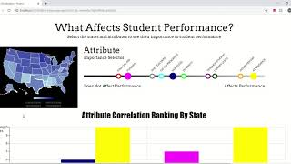

# Bar-Hoppers

Student education of is of utmost importance in the US. Millions if not billions of dollars are spent on education every year. 
The goal of our visualization is to help improve education and gain insight as to what factors seem to affect student performance the most. Are we using our money to improve education wisely? What things should we spend out time and money on to improve the future of the nation? This visualation shows the performance of students arcross the US in a heat map as well as a ranking of the most infuletial factors to performance of a few we wanted to explore. The users also has the ability to select states and attributes to explore these relation ships further in a bar chart. 

The following screencast explains the visualization further:

The projects website is with the screen cast can be found at [this link](https://colbywight.github.com)

Interactive Features: 
Click on states to add to x-axis of bar chart. 
Click on circles with attribute names hovering above on the attribute bar to add performance affecting attributes to the bar chart. (add more bars per state)

The code is in the js folder along with the data folder, css folder, and project html. We used the d3.js library which was included in the code. 

For a detailed description of how we came up with this solution see the [process book](process.md).

Also feel free to take a look at the [data](data).

